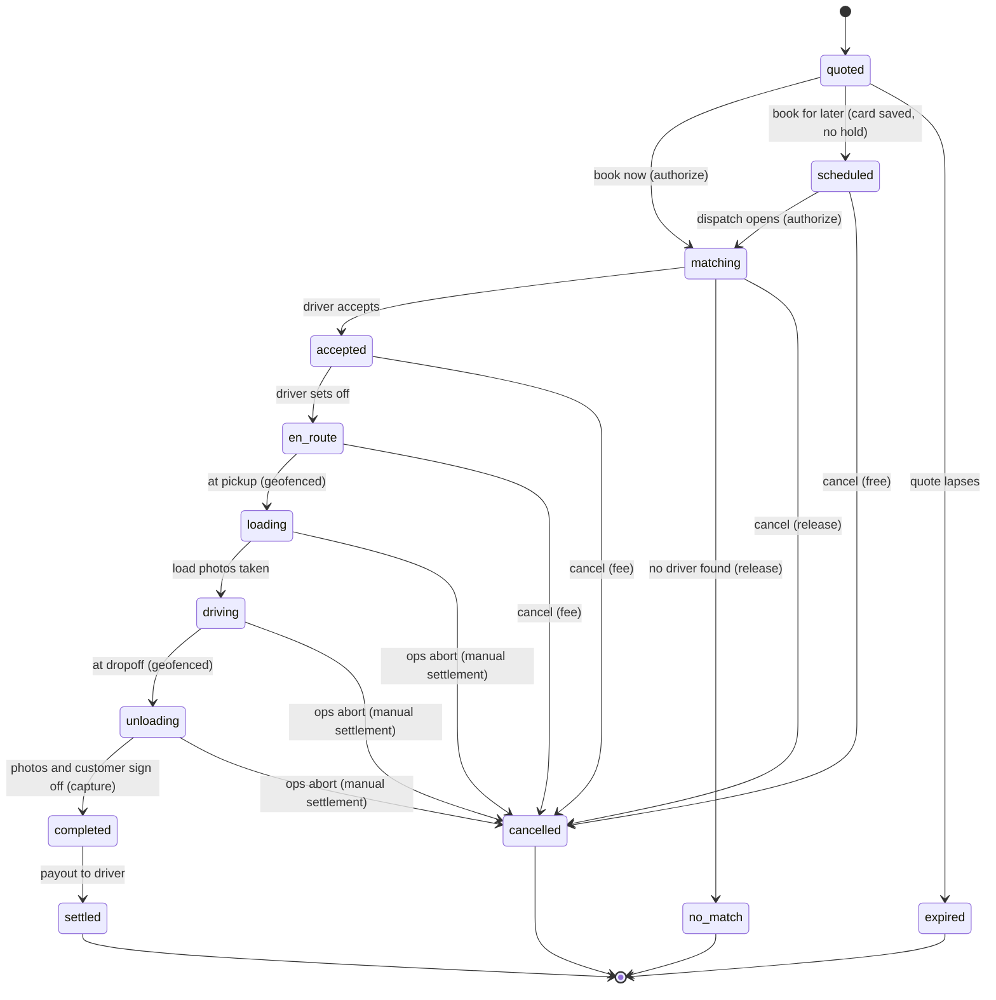

# HAUL

An on-demand moving and hauling marketplace for Israel. The customer lists what they own, gets a
price built from that inventory, and pays exactly that price.

**Status: in build, not launched.** Not deployed, no users, no revenue. The nine domain packages are
written and tested. The web app has its scaffold, locale routing and the booking draft plumbing. Its
booking screens and ops console are not built yet. The customer and driver mobile apps and the
dispatch service are designed but not written.

The idea the whole codebase is arranged around: the final bill should never be higher than the
quote. HAUL's product is the price lock, so the parts that make it hold (pricing, the job state
machine, the ledger) are where the engineering went.

## The job state machine

Every screen is meant to be a view onto one job state. Money moves at exactly three points:
**authorize** at booking (a hold, not a charge), **capture** at completion, **payout** at settlement.



13 states, 19 transitions, each with the actors allowed to fire it, pure guards, and its money effect.
Source: [packages/types/src/job-state.ts](packages/types/src/job-state.ts).

## What's interesting in here

**A state that exists because of Israeli payments.** Local payment processors hold a card
authorization for days, not weeks, and many moves are booked further ahead than that. So `scheduled`
keeps a validated card on file with no hold, and the hold is placed 24 hours before the move, when
the job opens to dispatch. A failed hold then surfaces with a day to fix it, not when the truck is
outside.
[job-state.ts](packages/types/src/job-state.ts)

**Pricing calibrated against the real market, and wrong by 1.9x on the first pass.** The engine
reconciled perfectly and still quoted a 5-room move at ₪9,660 against a market price of about ₪5,000.
The catalog timed every item as if it were carried alone, and real crews carry three boxes at once. I
added a batching term and fitted it numerically against four sourced apartment totals, and RMS error
came down to 3.3%. The engine is one pure package that previews on the client and decides on the
server. [working-minutes.ts](packages/pricing/src/working-minutes.ts),
[calibration.test.ts](packages/config/src/__tests__/calibration.test.ts), write-up in
[TRACKING.md](TRACKING.md)

**A double-entry ledger the database will not let go out of balance.** Money is an integer count of
agorot everywhere (a branded integer type in TypeScript, `bigint` in Postgres). Every posting is
checked in code, and again by a Postgres constraint trigger deferred to commit, so an unbalanced
transaction is rejected even from a console session or a future service in another language.
[postings.ts](packages/payments/src/postings.ts),
[001_postgis_and_constraints.sql](packages/db/sql/001_postgis_and_constraints.sql)

**A bug fixed in the type, not the data.** The Tel Aviv rate card's minimum fare had VAT removed
twice, so an advertised ₪400 floor was really ₪338.98. The guard that should have caught it was a
heuristic ("an advertised minimum is a round number") that only worked by luck. The fix makes the
field carry its VAT basis explicitly, so a bare number no longer parses.
[rate-card.ts](packages/pricing/src/rate-card.ts),
[minimum-fare.test.ts](packages/config/src/__tests__/minimum-fare.test.ts)

Also worth a look:

- The geospatial driver query has a test that asserts the **query plan**, not just the rows:
  `ST_DWithin` uses the GiST index (cost 2,191) where the equivalent `ST_Distance` form does a
  sequential scan (cost 37,735) at 3,000 drivers.
  [dispatch-query.test.ts](packages/db/src/__tests__/dispatch-query.test.ts)
- Button heights were built from runtime-assembled Tailwind classes, which Tailwind never sees, so
  every button had no height rule while the tests stayed green (they only checked the class string).
  The replacement compiles real Tailwind against the real theme.
  [tailwind.test.ts](packages/ui/src/__tests__/tailwind.test.ts)
- Israel is modelled, not translated: Shabbat and holiday cutoffs from computed candle lighting and
  nightfall times, a Sunday to Thursday work week, explicit VAT on every price breakdown, crane
  pricing by floor, and separate rails for taking card payments and paying drivers, because no local
  processor offers marketplace payouts.
- [TRACKING.md](TRACKING.md) has the locked decisions and a dated build log with the bugs written up.

## Tests

1,997 tests across ten workspaces, all passing. 1,250 of them are in the design system: color
contrast computed in both themes, tap targets resolved through the compiled stylesheet, and an RTL
scan across every source file. The rest cover the domain packages and the web app, including every
legal and illegal state transition.

## Stack

- TypeScript monorepo: Turborepo and pnpm workspaces
- Web: Next.js 16 (App Router), React 19, Tailwind CSS 4, Hebrew first with English, RTL throughout
- Data: PostgreSQL with PostGIS, Drizzle ORM, Zod for every boundary
- Local infra: Docker Compose (Postgres and PostGIS, plus Redis reserved for dispatch state)
- Tests: Vitest

## Layout

```
apps/
  web/          Next.js app: landing page, locale routing, booking draft plumbing
packages/
  types/        Shared domain schemas, the job state machine, money
  pricing/      The pricing engine. Pure. The client previews it, the server decides it
  config/       Item catalog, vehicles, presets, the Tel Aviv rate card
  calendar/     Israeli operating calendar: Shabbat, holidays, bookable days
  payments/     Card acquiring, driver payout, ledger postings
  db/           Drizzle schema and migrations, PostGIS queries, ledger constraints
  geo/          Routed distance and places
  contracts/    Request and response shapes on the wire, the booking step model
  ui/           Design system: one token file, generated Tailwind theme
```

Designed but not yet written: `apps/mobile` (Expo customer and driver apps) and `services/dispatch`
(a stateful matcher with live connections and per-offer timers, kept out of the serverless web app on
purpose).

## How it was built

I built HAUL solo, with Claude Code as a pair programmer. The architecture, the tests and the
decisions are mine, and the commits carry a Claude co-author line because that is how the work was
done.

## Run locally

Requires Node 22 or later, pnpm and Docker.

```bash
pnpm install
cp .env.example .env      # the local stack runs without keys
pnpm infra:up             # Postgres with PostGIS, and Redis, in Docker
pnpm db:migrate
pnpm db:seed
pnpm dev
```

| Command                                       | Does                             |
| --------------------------------------------- | -------------------------------- |
| `pnpm dev`                                    | Every app in watch mode          |
| `pnpm typecheck`                              | Types across the whole workspace |
| `pnpm test`                                   | All test suites                  |
| `pnpm infra:up` / `pnpm infra:down`           | Local Postgres and Redis         |
| `pnpm infra:reset`                            | Wipe volumes and start clean     |
| `pnpm db:generate` / `db:migrate` / `db:seed` | Drizzle migrations and seed data |

## License

All rights reserved. See [LICENSE](LICENSE).
